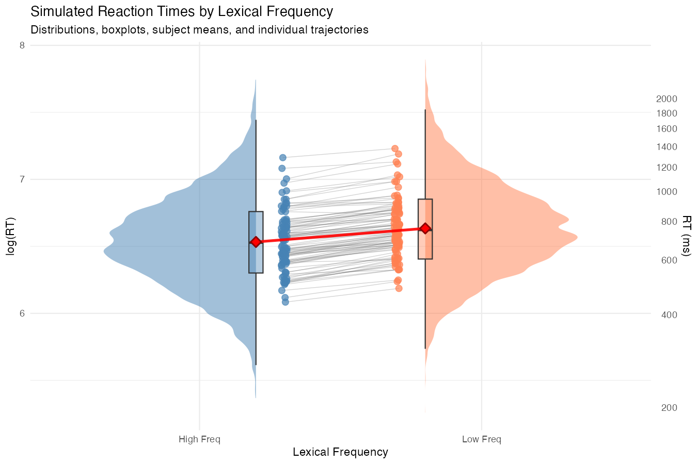
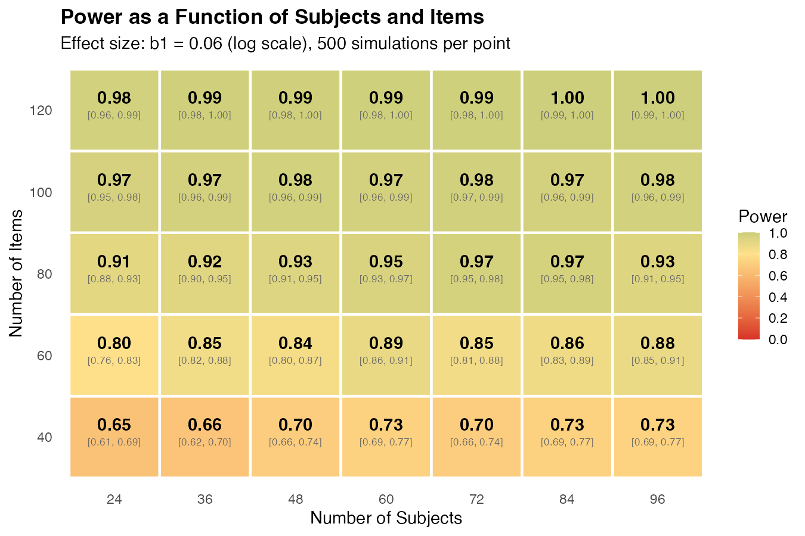
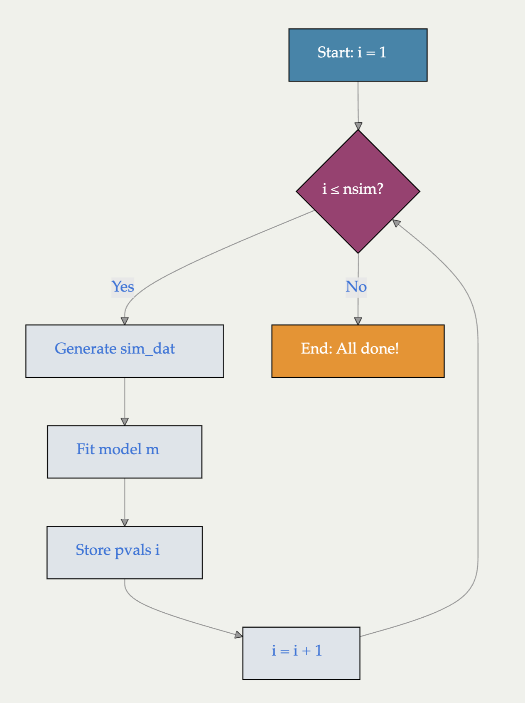

# The logic of simulations for power analysis

The slide deck for Part 1 walks through five steps in any simulation-based power analysis:

1. Define how data are generated (the data-generating process).
2. Simulate data according to that process.
3. Fit the statistical model to the simulated data and extract relevant statistics
   (t-values, p-values).
4. Repeat steps 2 and 3 many times (often 1000+).
5. Calculate power as the proportion of p-values below 0.05 — the proportion of times
   the effect is detected when it is present.

Two additional reasons to use this approach beyond power estimation:

- **Parameter recovery.** Understand which parameters can in principle be recovered
  from the model under repeated sampling.
- **Sensitivity.** Repeat the simulation across different effect sizes and sample sizes
  to see how those factors influence power.

In this part of the course we cover two examples: a **between-subjects design**
(independent-samples t-test and linear model) and a **within-subjects design**
(paired t-test and linear mixed-effects model).

# The lexical decision task (LDT)

The lexical decision task is a common paradigm in psycholinguistics and cognitive
science. Participants decide as quickly as possible whether a string of letters is
a real word or a pseudoword.

Researchers typically manipulate a characteristic of the real words (word
frequency, word length, etc.) and measure how this manipulation affects reaction
times and accuracy.

Pseudowords are usually included only to keep participants honest about reading
the stimuli — they are not of primary interest and are generally not analyzed.

In the examples below, we will simulate data for an LDT experiment comparing reaction
times for high-frequency words versus low-frequency words.

# Where we are heading

Before we dive in, here is the final picture so you know what we are building
towards. The next eight parts of the course assemble this piece by piece —
you do **not** need to understand any of this yet.

## The final generative model

By the end of Part 7, we will be simulating reaction times from this
**log-normal mixed-effects model**:

$$
\log(rt_{ij}) = \beta_0 + u_{0i} + w_{0j} + (\beta_1 + u_{1i}) \times \text{cond.cod}_{ij} + \varepsilon_{ij}
$$

with seven parameters:

- $\beta_0$ — grand mean on the log scale
- $\beta_1$ — the lexical-frequency effect
- $u_{0i}, u_{1i}$ — by-subject adjustments to the intercept and the slope (correlated by $\rho$)
- $w_{0j}$ — by-item adjustments to the intercept
- $\varepsilon_{ij}$ — residual noise

And we will fit it with the corresponding `lmer()` call:

```r
m <- lmer(log(rt) ~ cond.cod + (1 + cond.cod | subj) + (1 | item),
          data = sim_dat)
```

## What the simulated data look like

```{r}
#| label: fig-preview-raincloud
#| echo: false
#| fig-cap: "Simulated reaction times from the final model (n = 100 subjects, k = 100 items per condition). Each subject has their own mean RT and their own frequency-effect size; the red diamonds mark the grand means. This is what 'simulating from the final generative process' produces."
#| fig-align: center
#| out-width: "85%"


```

## The power analysis itself

Once we have a generator and a model, we wrap them in **two nested
for-loops** to estimate power across a grid of design choices:

```
for each (n_subjects, n_items) combination on the grid:
    for i in 1:nsim:
        generate one simulated dataset with these parameters
        fit lmer(log(rt) ~ cond.cod + (1 + cond.cod | subj) + (1 | item))
        extract the p-value for the condition effect
    power[this cell] = proportion of p-values below 0.05
```

The outer loop sweeps the design space; the inner loop is the Monte Carlo
estimate of power at each cell. The output is a power table — for example:

```{r}
#| label: fig-preview-heatmap
#| echo: false
#| fig-cap: "Power as a function of the number of subjects and the number of items per condition, for a small effect size (b1 = 0.06 on the log scale). Each cell is the proportion of 500 simulated datasets in which the condition effect reached p < 0.05; brackets are the 95% Clopper-Pearson confidence interval."
#| fig-align: center
#| out-width: "90%"


```

This heatmap is the kind of deliverable a sample-size justification produces.
By the end of Part 8 you will have built one yourself.

::: callout-tip
**Take-away.** Everything in the next eight parts is in service of building
the formula above, the simulator that generates data from it, and the two
loops that turn it into the power table. We will assemble them
**incrementally** — one new random effect, one new design feature, one new
distribution at a time.
:::

# Between-subjects design

Imagine we have reaction-time data in milliseconds from 10 participants who responded
to high-frequency words and a different group of 10 participants who responded to
low-frequency words. Assume:

- Standard deviation: 200 ms (within-condition variability across subjects).
- True mean for high-frequency words: 700 ms.
- True mean for low-frequency words: 750 ms.
- True difference between conditions: **50 ms**.

The aim is to determine whether a study with this design and these parameter values
gives enough statistical power to reliably detect the 50 ms difference.

## Setup

The first time you run the code, install the packages used in this course:

```{r}
#| label: install-packages
#| echo: true
#| eval: false

install.packages("tictoc")   # for timing
install.packages("MASS")     # for multivariate normal distribution
install.packages("lme4")     # for mixed models
install.packages("lmerTest") # for p-values in mixed models
install.packages("ggplot2")  # for plotting
install.packages("rio")      # for data import (used in Part 7)
```

Load packages at the start of every session:

```{r}
#| label: setup
#| echo: true
#| eval: true

suppressPackageStartupMessages({
  library(tictoc)
  library(MASS)
  library(lme4)
  library(lmerTest)
  library(ggplot2)
})

options(scipen = 999) # prevents scientific notation
options(width = 120)  # wider console output for HTML rendering
set.seed(42)          # set seed for reproducibility
```

## Simulating a single dataset

To simulate one between-subjects dataset:

- Take 10 samples from $\text{Normal}(\mu = 700, \sigma = 200)$ — the high-frequency
  group.
- Take 10 samples from $\text{Normal}(\mu = 750, \sigma = 200)$ — the low-frequency
  group.
- Combine into a data frame with subject id and a condition factor.

```{r}
#| label: generate-between-subjects-data
#| echo: true
#| eval: true

freq_high <- rnorm(10, mean = 700, sd = 200) # data for high-frequency words
freq_low  <- rnorm(10, mean = 750, sd = 200) # data for low-frequency words

subj     <- 1:20                                          # subject IDs
cond     <- rep(c("freq_high", "freq_low"), each = 10)      # condition factor
cond.cod <- ifelse(cond == "freq_high", -0.5, 0.5)         # numerical coding (explained later)

sim_dat <- data.frame(
  subj     = subj,
  cond     = cond,
  cond.cod = cond.cod,
  rt       = c(freq_high, freq_low)
)
sim_dat
```

## Wrapping the simulation in a function

To repeat the data generation many times we wrap the logic above into a function with
sensible default values:

```{r}
#| label: define-betwsubj-simdat-ldt
#| echo: true
#| eval: true

betwsubj_simdat_ldt <- function(n = 10,
                                mean_freq_high = 700,
                                mean_freq_low  = 750,
                                stdev     = 200) {
  # generate data:
  freq_high <- rnorm(n, mean = mean_freq_high, sd = stdev)
  freq_low  <- rnorm(n, mean = mean_freq_low,  sd = stdev)

  subj     <- 1:(2 * n)
  cond     <- factor(rep(c("freq_high", "freq_low"), each = n))
  cond.cod <- ifelse(cond == "freq_high", -0.5, 0.5)

  sim_dat <- data.frame(
    subj     = subj,
    cond     = cond,
    cond.cod = cond.cod,
    rt       = c(freq_high, freq_low)
  )
}
```

With the function defined, generating new simulated data is a one-liner:

```{r}
#| label: demo-100-iter-loop
#| echo: true
#| eval: false

for (i in 1:100) {
  sim_dat <- betwsubj_simdat_ldt()
}
```

We will use this repeated generation for two purposes: **power analysis** (counting
how often we detect the effect) and **parameter recovery** (checking that the model
returns the parameters we put in).

# Computing power

## Analytical solution

For a simple between-subjects design with known parameters, the analytical solution
via `power.t.test()` gives:

```{r}
#| label: power-analytical-ttest
#| echo: true
#| eval: true

round(
  power.t.test(delta = 50, n = 10,
               sd = 200,
               type = "two.sample",
               alternative = "two.sided",
               strict = TRUE)$power,
  3
)
```

With n = 10 per group and a 50 ms effect, the analytical power is only around 7% —
far below the conventional 80% target.

## Simulation-based solution

We can recover this same answer by repeated simulation:

```{r}
#| label: power-simulation-ttest
#| echo: true
#| eval: true

nsim  <- 1000                  # number of simulations
pvals <- rep(NA, nsim)         # vector to store p-values

for (i in 1:nsim) {
  sim_dat   <- betwsubj_simdat_ldt()
  pvals[i] <- t.test(rt ~ cond.cod, data = sim_dat)$p.value
}

power <- mean(pvals < 0.05)
power
```

The simulation-based estimate should converge to the analytical value as `nsim`
grows. With 1000 simulations the typical sampling error is about ±2 percentage
points.

::: callout-tip
## When to use simulations
For simple between-subjects designs you can rely on analytical solutions. Simulations
become essential for more complex designs — within-subjects, mixed effects,
non-Gaussian distributions, multi-level data — where no closed-form solution exists.
:::

## The for-loop structure

The following diagram dissects the for-loop used above:

```{r}
#| label: fig-for-loop
#| echo: false
#| fig-cap: "For loop dissection."
#| fig-align: center
#| out-width: "70%"


```

# Exercise

Modify the code below to compute power through simulations for different parameter
values. Vary the number of simulations, the sample size per condition, the means for
low- and high-frequency words, and the standard deviation.

```{r}
#| label: exercise-modify-power-sim
#| echo: true
#| eval: false

# define the number of simulations:
nsim <- # MODIFY HERE

# create an empty vector to store p-values:
pvals <- rep(NA, nsim)

# run the simulations nsim times:
tic()
for (i in 1:nsim) {
  sim_dat <- betwsubj_simdat_ldt(n         = , # MODIFY HERE
                                 mean_freq_high = , # MODIFY HERE
                                 mean_freq_low  = , # MODIFY HERE
                                 stdev     =   # MODIFY HERE
  )
  pvals[i] <- t.test(rt ~ cond.cod, data = sim_dat)$p.value
}
toc()

power_sim <- mean(pvals < 0.05)
round(power_sim, 3)
```

Questions to investigate:

1. How many subjects per group are needed to achieve 80% power, given a true
   difference of 50 ms and SD = 200 ms?
2. How many subjects per group are needed for 80% power if the true difference is
   reduced to 30 ms (SD = 200 ms)?
3. What if the SD were only 100 ms instead of 200 ms?

Worked solutions appear in the separate Exercise 1 handout.

# Next step

Having established the simulation logic on the between-subjects design with the
independent-samples t-test, the next part of the course translates the same approach
to the linear-modeling framework. After that we move to within-subjects designs
(paired t-test and linear mixed-effects models).

# Session information

```{r}
#| label: session-info
#| echo: false
#| eval: true
#| code-fold: true

sessionInfo()
```
