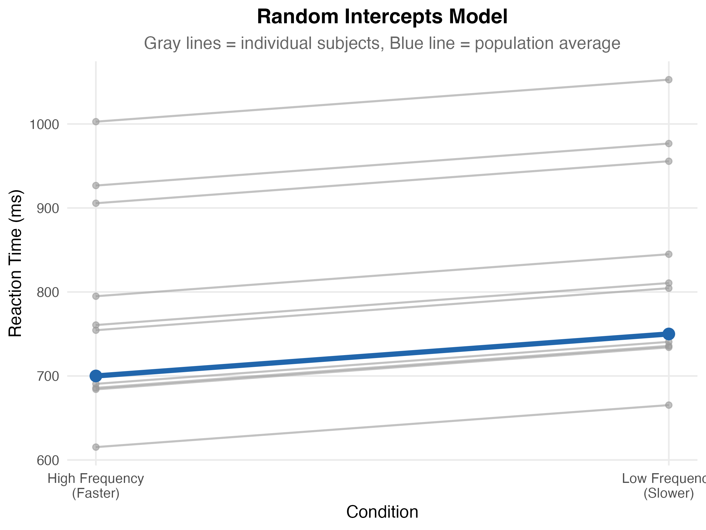

```{r}
#| label: setup
#| echo: false
#| eval: true

# load packages (suppress startup messages from lme4, lmerTest, etc.)
suppressPackageStartupMessages({
  library(tictoc)
  library(MASS)
  library(lme4)
  library(lmerTest)
  library(ggplot2)
})

options(scipen = 999) # prevents scientific notation
options(width = 120)  # wider console output for HTML rendering
set.seed(42)          # set seed for reproducibility
```

# From between- to within-subjects designs

Part 1 simulated a between-subjects design where 20 people were split into two
groups of 10, each group seeing only one condition (high- or low-frequency words).
That design throws away a lot of statistical power because the between-subjects
variability is huge: people read at very different speeds, and that variability
ends up in the noise term.

In a **within-subjects design** every subject sees both conditions. We collect two
data points per person — one for high-frequency words, one for low-frequency words —
and the contrast between conditions is computed *within* each subject. This removes
the between-subjects variability from the comparison and dramatically increases power
for the same number of subjects.

But there is a cost: the two observations from the same subject are no longer
**independent**. They share whatever makes that subject fast or slow overall. The
analysis has to account for this dependency, and so does the data-generating process
when we simulate.

# A first (incorrect) attempt

If we just write the same code as in Part 1, with 10 subjects each contributing two
observations, we get a data frame that *looks* right:

```{r}
#| label: within-subj-naive-independent
#| echo: true
#| eval: true

n        <- 10                                                  # number of subjects
freq_high <- round(rnorm(n, mean = 700, sd = 200))               # data for high freq
freq_low  <- round(rnorm(n, mean = 750, sd = 200))               # data for low freq

subj     <- rep(1:n, times = 2)                                 # subject vector
cond     <- factor(rep(c("freq_high", "freq_low"), each = n))     # condition vector
cond.cod <- ifelse(cond == "freq_high", -0.5, 0.5)               # effects coding

sim_dat <- data.frame(
  subj     = subj,
  cond     = cond,
  cond.cod = cond.cod,
  rt       = c(freq_high, freq_low)
)
sim_dat
```

We now have two observations per subject — one in each condition. But there is a
problem: this code **assumes** the two observations from the same subject are
independent, because `freq_high` and `freq_low` were generated from two separate
`rnorm()` calls. The fact that they share a `subj` value is just bookkeeping; the
generative process is still between-subjects in disguise.

# Inducing dependency between observations

To simulate true within-subjects data we need each subject to have their own *true
mean processing time*, which biases both of their observations in the same direction.
Some subjects are systematically faster than 725 ms, others systematically slower.
We capture this with a **by-subject adjustment to the intercept**, drawn from a
normal distribution centred on zero:

```{r}
#| label: generate-subject-adjustments
#| echo: true
#| eval: true

# generate adjustment to the intercept for each subject:
subject_adj <- round(rnorm(n, mean = 0, sd = 150))
subject_adj
```

A value of 0 means the subject's true grand mean is exactly 725 ms. Positive values
mean slower than average, negative values faster than average. Adding the
adjustments to the grand mean gives each subject's own baseline:

```{r}
#| label: subject-adjustments-plus-grand-mean
#| echo: true
#| eval: true

round(725 + subject_adj)
```

Visually:

```{r}
#| label: fig-subject-adjustments-barplot
#| echo: false
#| eval: true
#| fig-cap: "Subject-specific RT adjustments. Positive values are slower-than-average subjects; negative values are faster-than-average."

barplot(subject_adj,
        main = "Subject-Specific RT Adjustments",
        ylab = "Adjustment (ms)",
        xlab = "Subject",
        col  = ifelse(subject_adj > 0, "coral", "lightblue"),
        names.arg = 1:n)
abline(h = 0, lty = 2, col = "gray50")
legend("topright", legend = c("Faster than average", "Slower than average"),
       fill = c("lightblue", "coral"), cex = 0.8)
```

# Generating dependent data

Now we replace the naive (independent) RT column with values that incorporate the
subject-specific adjustment. The generative formula is:

$$
rt_{ij} = \beta_0 + u_{0i} + \beta_1 \cdot \text{cond.cod}_{ij} + \epsilon_{ij}
$$

with the following terms:

- $rt_{ij}$ = simulated response time for subject $i$ in condition $j$
- $\beta_0 = 725$ = grand mean (intercept)
- $u_{0i} \sim \text{Normal}(0, 150)$ = by-subject adjustment to the grand mean (the *random intercept*)
- $\beta_1 = 50$ = condition effect (slope)
- $\text{cond.cod}_{ij}$ = effects-coded condition (-0.5 / +0.5)
- $\epsilon_{ij} \sim \text{Normal}(0, 200)$ = residual error

Translated to code:

```{r}
#| label: replace-rt-with-dependent
#| echo: true
#| eval: true

rt <- round(725 +                             # grand mean
              rep(subject_adj, times = 2) +   # subject adjustments (repeated for both conditions)
              50 * cond.cod +                 # condition effect
              rnorm(2 * n, mean = 0, sd = 200)) # residual error

# replace the incorrect rt column in sim_dat with the dependent rt values:
sim_dat$rt <- rt
sim_dat
```

The `rep(subject_adj, times = 2)` is the key trick: the same subject adjustment is
added to *both* observations from each subject, which is what creates the dependency.

## What does this look like?

```{r}
#| label: fig-random-intercepts-spaghetti
#| echo: false
#| fig-cap: "Random-intercepts model with 10 simulated subjects. Each gray line is one subject (with their own baseline RT, drawn from Normal(0, 150) around the grand mean). The blue line is the population average. Notice that the lines are **parallel** — every subject shows the same 50 ms effect, only their baseline differs."
#| fig-align: center
#| out-width: "85%"


```

Each gray line above is one simulated subject. The vertical spread reflects $u_{0i}$
— different baseline RTs. The lines are **parallel** because at this point in the
course we still assume every subject shows the same 50 ms effect. Part 4 will relax
that assumption.

# Analyzing the data

There are two equivalent ways to analyse this within-subjects design. The
paired t-test is the classical approach; the linear mixed-effects model (LMM)
is the modern generalisable one. Click between the tabs below to compare:

::: panel-tabset

## Paired t-test

```{r}
#| label: paired-ttest
#| echo: true
#| eval: true

freq_low_vals  <- sim_dat$rt[sim_dat$cond == "freq_low"]
freq_high_vals <- sim_dat$rt[sim_dat$cond == "freq_high"]
t.test(freq_low_vals, freq_high_vals, paired = TRUE)
```

The paired t-test directly subtracts each subject's two observations, removing
the by-subject baseline before testing.

## Linear mixed-effects model

```{r}
#| label: lmer-random-intercept
#| echo: true
#| eval: true

m <- lmer(rt ~ cond.cod + (1 | subj), sim_dat,
          control = lmerControl(calc.derivs = FALSE))
summary(m)
```

The `(1 | subj)` term tells the model: "each subject has their own intercept,
drawn from a normal distribution centred on the grand mean". This is exactly the
data-generating process we used above.

:::

The t-value for the `cond.cod` coefficient matches the paired t-test t-value —
**the two approaches are mathematically equivalent** for this simple case.

The mixed-effects formulation matters for the rest of the course: it scales
naturally to designs with multiple trials per condition per subject, by-item
variability, correlated random effects, and so on. The paired t-test does not.

# Comparing power: paired t-test vs. mixed model

We repeat the simulation 1000 times and compute power both ways. The result confirms
that the two approaches give essentially identical power estimates:

```{r}
#| label: power-paired-vs-lmer
#| echo: true
#| eval: true

nsim <- 1000
pvals_paired <- pvals_lmer <- rep(NA, nsim)

for (i in 1:nsim) {
  subject_adj <- round(rnorm(n, mean = 0, sd = 150))
  sim_dat$rt  <- round(725 +
                         rep(subject_adj, 2) +
                         50 * cond.cod +
                         rnorm(2 * n, 0, 200))

  # paired t-test:
  freq_low_vals    <- sim_dat$rt[sim_dat$cond == "freq_low"]
  freq_high_vals   <- sim_dat$rt[sim_dat$cond == "freq_high"]
  pvals_paired[i] <- t.test(freq_low_vals, freq_high_vals, paired = TRUE)$p.value

  # linear mixed-effects model:
  m_temp        <- lmer(rt ~ cond.cod + (1 | subj), sim_dat,
                        control = lmerControl(calc.derivs = FALSE))
  pvals_lmer[i] <- summary(m_temp)$coefficients[2, 5]
}

mean(pvals_paired < 0.05) # paired t-test
mean(pvals_lmer   < 0.05) # linear mixed-effects model
```

Both estimates should be near each other. Note that this power is **much higher**
than the corresponding between-subjects estimate from Part 1 (7%) with the same
sample size and effect: the within-subjects design wins decisively because the
subject-level variance no longer enters the comparison.

# Wrapping it in a function

For all subsequent simulations we will reuse a clean data-generation function:

```{r}
#| label: define-withinsubj-simdat
#| echo: true
#| eval: true

withinsubj_simdat <- function(n = 10,            # number of subjects
                              b0 = 725,          # grand mean (intercept)
                              b1 = 50,           # condition effect (slope)
                              sigma_u0 = 150,    # SD of random intercepts
                              sigma = 200) {     # residual SD
  u0       <- round(rnorm(n, mean = 0, sd = sigma_u0)) # subject adjustments
  cond.cod <- rep(c(-0.5, 0.5), each = n)              # effects-coded condition
  subj     <- rep(1:n, times = 2)                      # subject vector

  # generate dependent response times:
  rt <- round(b0 +
                rep(u0, times = 2) +
                b1 * cond.cod +
                rnorm(2 * n, mean = 0, sd = sigma))

  data.frame(subj = subj, cond.cod = cond.cod, rt = rt)
}
```

# Parameter recovery

Just like in Part 1.2, we want to check whether the model can recover the true
parameter values under repeated sampling. Now we have **four** parameters to
recover: the intercept ($\beta_0 = 725$), the slope ($\beta_1 = 50$), the SD of the
random intercepts ($\sigma_{u0} = 150$), and the residual SD ($\sigma = 200$).

The only thing that changes between the two tabs below is the number of
subjects (`n = 10` vs `n = 100`). Compare the histograms to see how parameter
recovery improves with more data.

::: panel-tabset

## n = 10 subjects

```{r}
#| label: parameter-recovery-n10
#| echo: true
#| eval: true

nsim   <- 1000
params <- matrix(rep(NA, nsim * 4), ncol = 4)

for (i in 1:nsim) {
  sim_dat <- withinsubj_simdat()
  m       <- lmer(rt ~ cond.cod + (1 | subj), sim_dat,
                  control = lmerControl(calc.derivs = FALSE))
  params[i, 1] <- summary(m)$coefficients[1, 1]              # intercept
  params[i, 2] <- summary(m)$coefficients[2, 1]              # slope
  params[i, 3] <- attr(VarCorr(m)$subj, "stddev")            # sd random intercepts
  params[i, 4] <- attr(VarCorr(m), "sc")                     # residual SD
}
```

```{r}
#| label: fig-parameter-recovery-n10
#| echo: false
#| eval: true
#| fig-cap: "Parameter recovery with n = 10 subjects, 1000 simulations. Red lines mark the true generating values."

op <- par(mfrow = c(2, 2), pty = "s")
hist(params[, 1], main = "b0 (intercept)", col = "lightblue")
abline(v = 725, col = "red", lwd = 2)
hist(params[, 2], main = "b1 (slope)", col = "lightblue")
abline(v = 50, col = "red", lwd = 2)
hist(params[, 3], main = "sd random intercepts", col = "lightblue")
abline(v = 150, col = "red", lwd = 2)
hist(params[, 4], main = "sd residuals", col = "lightblue")
abline(v = 200, col = "red", lwd = 2)
par(op)
```

Two pathologies are visible. First, **the slope $\beta_1$ is all over the
place** — the histogram is wide and noisy. Second, **the by-subject SD
($\sigma_{u0}$) is frequently estimated as exactly 0** (a spike at zero in the
histogram). With only n = 10 subjects there is not enough information to
separate subject-level variance from residual variance, and the optimizer
collapses the random intercept term.

## n = 100 subjects

```{r}
#| label: parameter-recovery-n100
#| echo: true
#| eval: true

nsim   <- 1000
params <- matrix(rep(NA, nsim * 4), ncol = 4)

for (i in 1:nsim) {
  sim_dat <- withinsubj_simdat(n = 100) # this is what we change
  m       <- lmer(rt ~ cond.cod + (1 | subj), sim_dat,
                  control = lmerControl(calc.derivs = FALSE))
  params[i, 1] <- summary(m)$coefficients[1, 1]
  params[i, 2] <- summary(m)$coefficients[2, 1]
  params[i, 3] <- attr(VarCorr(m)$subj, "stddev")
  params[i, 4] <- attr(VarCorr(m), "sc")
}
```

```{r}
#| label: fig-parameter-recovery-n100
#| echo: false
#| eval: true
#| fig-cap: "Parameter recovery with n = 100 subjects, 1000 simulations. The estimates now cluster tightly around the true values."

op <- par(mfrow = c(2, 2), pty = "s")
hist(params[, 1], main = "b0 (intercept)", col = "lightblue")
abline(v = 725, col = "red", lwd = 2)
hist(params[, 2], main = "b1 (slope)", col = "lightblue")
abline(v = 50, col = "red", lwd = 2)
hist(params[, 3], main = "sd random intercepts", col = "lightblue")
abline(v = 150, col = "red", lwd = 2)
hist(params[, 4], main = "sd residuals", col = "lightblue")
abline(v = 200, col = "red", lwd = 2)
par(op)
```

With n = 100 subjects the estimates are **much narrower and more precise**, and
the zero-variance pathology disappears.

:::

This is the parameter-recovery payoff: simulation tells you in advance whether
your design has the information needed to estimate the parameters of interest —
separately from whether it has enough power.

# Summary and next step

So far we have:

- Recognised that within-subjects observations are dependent and need a random
  intercept to model that dependency.
- Compared the paired t-test and the random-intercept linear mixed-effects model
  and found them equivalent for the simplest case.
- Used parameter recovery to diagnose the failure mode at n = 10 (zero-variance
  estimates of the random intercept) and the resolution at n = 100.

So far we have simulated only **one observation per condition per subject**:

```{r}
#| label: xtabs-one-obs-per-subj-cond
#| echo: true
#| eval: true

head(xtabs(~ subj + cond.cod, sim_dat))
```

The next part of the course generalises to **multiple repeated measures per
condition per subject** — the typical case in cognitive experiments, where each
subject contributes dozens of trials per condition.

# Session information

```{r}
#| label: session-info
#| echo: false
#| eval: true
#| code-fold: true

sessionInfo()
```
