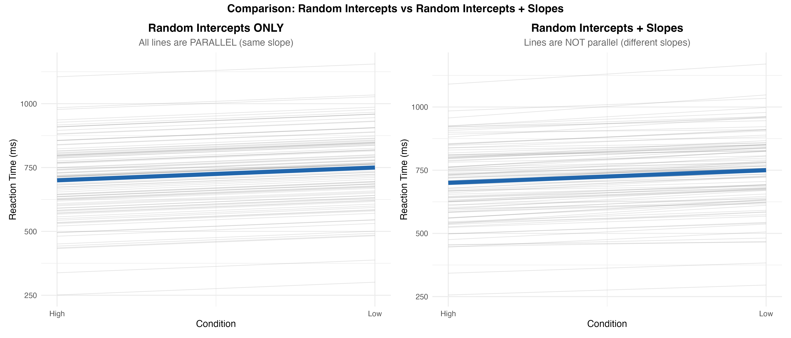

```{r}
#| label: setup
#| echo: false
#| eval: true

# load packages (suppress startup messages from lme4, lmerTest, etc.)
suppressPackageStartupMessages({
  library(tictoc)
  library(MASS)
  library(lme4)
  library(lmerTest)
  library(ggplot2)
})

options(scipen = 999) # prevents scientific notation
options(width = 120)  # wider console output for HTML rendering
set.seed(42)          # set seed for reproducibility
```

# From varying intercepts to varying slopes

So far our simulations have allowed each subject to have **their own intercept**
(their mean processing speed), but the lexical-frequency effect was a constant 50
ms for everyone.

That assumption is unrealistic. In real experiments, some subjects show a larger
frequency effect than others. Some show a smaller effect. Some are close to the
group mean.

This part of the course **adds by-subject variability to the slope** as well.
The generative process gains one parameter ($\sigma_{u1}$) and one new term in
the formula.

```{r}
#| label: fig-intercepts-vs-slopes-comparison
#| echo: false
#| fig-cap: "Visual contrast of the two models. **Left:** random intercepts only — every line has a different baseline but the same slope, so the lines are parallel. **Right:** random intercepts AND random slopes — the lines fan out, reflecting that subjects also differ in the *size* of their frequency effect."
#| fig-align: center
#| out-width: "95%"


```

The left panel is the model from Part 2/3. The right panel is what we are about
to build in Part 4. Notice the lines are no longer parallel — that fanning is
the visual signature of by-subject slope variability.

# Generating subject-specific slopes

We model subjects' variation around the mean slope as draws from a normal
distribution centred on zero, with some standard deviation. A reasonable starting
value is $\sigma_{u1} = 20$ ms:

$$
u_{1i} \sim \text{Normal}(0, 20)
$$

In code:

```{r}
#| label: rebuild-design-from-part3
#| echo: false
#| eval: true

# Rebuild the design matrix from Part 3
n <- 20  # subjects
k <- 20  # 20 per condition

cond.cod <- rep(c(-0.5, 0.5), each = n * k)
subj <- rep(rep(1:n, each = k), times = 2)
sim_dat <- data.frame(subj = subj, cond.cod = cond.cod)
```

```{r}
#| label: generate-slope-adjustments-u1
#| echo: true
#| eval: true

(u1 <- round(rnorm(n, mean = 0, sd = 20)))
```

Some subjects have positive $u_{1i}$ (a larger-than-average effect), others
negative (a smaller-than-average effect). Adding the adjustments to the mean
slope of 50 ms gives each subject's own effect size:

```{r}
#| label: show-mean-slope-plus-u1
#| echo: true
#| eval: true

(50 + u1)
```

So some subjects will show ~30 ms, others ~70 ms, around the population mean of
50 ms.

# Generating the data

The full generative formula now becomes:

$$
rt_{ij} = \beta_0 + u_{0i} + (\beta_1 + u_{1i}) \times \text{cond.cod}_{ij} + \varepsilon_{ij}
$$

with:

- $u_{0i} \sim \text{Normal}(0, 150)$ — by-subject adjustments to the intercept
- $u_{1i} \sim \text{Normal}(0, 20)$ — by-subject adjustments to the slope
- $\varepsilon_{ij} \sim \text{Normal}(0, 200)$ — residual error

This is the **varying intercepts and varying slopes** model.

Translated to code, with the nested `rep()` calls from Part 3:

```{r}
#| label: generate-rt-varying-slopes
#| echo: true
#| eval: true

rt <- 725 +
        rep(rep(round(rnorm(n, 0, 150)), each = k), times = 2) +   # by-subject intercepts
        (50 +
          rep(rep(round(rnorm(n, 0,  20)), each = k), times = 2)) * cond.cod +  # by-subject slopes
        rnorm(n * k * 2, 0, 200)                                   # residual error

sim_dat$rt <- rt
```

# Visualising by-subject slopes

Plotting each subject's data with a per-subject regression line shows the
variability in slopes:

```{r}
#| label: fig-bysubject-slopes
#| echo: false
#| eval: true
#| fig-width: 8
#| fig-height: 8
#| fig-cap: "Per-subject regression lines for the first 16 subjects. Different slopes mean different sizes of the lexical-frequency effect."

gg_xyplot <- function(x, y, formula, shape, size,
                      xlabel = "Lexical Frequency",
                      ylabel = "RT (ms)",
                      data = sim_dat) {
  ggplot(data = data, aes(x = data[, x], y = data[, y])) +
    facet_wrap(formula) +
    geom_smooth(method = "lm") +
    geom_point(color = "blue", shape = shape, size = size) +
    theme(panel.grid.minor = element_blank()) +
    theme_bw() +
    ylab(ylabel) +
    xlab(xlabel)
}

sim_dat_subset <- sim_dat[sim_dat$subj %in% 1:16, ]
gg_xyplot(x = "cond.cod", y = "rt", formula = ~subj,
          shape = 16, size = 1, data = sim_dat_subset)
```

Each panel is one subject. The slope of the blue line is that subject's
lexical-frequency effect. They are clearly different across people — that is
exactly the variability we just added to the data-generating process.

# Fitting the uncorrelated random-slopes model

The corresponding LMM allows both intercepts and slopes to vary by subject. We
use the **double vertical bar** `||` syntax to fit a model that does *not*
estimate the correlation between intercepts and slopes:

```{r}
#| label: lmer-uncorrelated-slopes-summary
#| echo: true
#| eval: true

m3 <- lmer(rt ~ cond.cod + (1 + cond.cod || subj), sim_dat,
           control = lmerControl(calc.derivs = FALSE))
summary(m3)
```

::: callout-note
The `||` (double bar) syntax fits **uncorrelated** random effects. The single
bar `|` would fit the **correlated** version — but in Part 3 we saw that
correlated random effects need additional structure in the generative process to
avoid the $\pm 1$ collapse.

Part 5 will add a true correlation between intercepts and slopes and switch back
to the `|` syntax.
:::

# A more sophisticated generative process

Instead of generating subject adjustments inline with nested `rep()` calls, we
can build a **separate data frame** with one row per subject containing both
random effects. This generalises cleanly when we later add more random effects.

```{r}
#| label: build-u-matrix-adjustments
#| echo: true
#| eval: true

n <- 20  # subjects
k <- 20  # trials per condition

cond.cod <- rep(c(-0.5, 0.5), each = n * k)
sim_dat  <- data.frame(
  subj     = rep(rep(1:n, each = k), times = 2),
  cond.cod = cond.cod
)

sigma_u0 <- 150
sigma_u1 <- 20

u <- data.frame(
  subject = 1:n,
  u0      = rnorm(n, 0, sigma_u0), # random intercepts
  u1      = rnorm(n, 0, sigma_u1)  # random slopes
)
head(u)
```

Now `u` is a small data frame with one row per subject. We will plug it into the
data-generating formula by looking up each subject's adjustments as we go through
the rows of `sim_dat`.

# Generating RTs row by row

The row-by-row loop reads cleanly because each row's adjustment comes from the
corresponding row of `u`:

```{r}
#| label: generate-rt-row-by-row
#| echo: true
#| eval: true

nrows <- dim(sim_dat)[1]
rt    <- rep(NA, nrows)

b0    <- 725
b1    <- 50
sigma <- 200

for (i in 1:nrows) {
  rt[i] <- b0 +                                                  # grand mean
           u[sim_dat[i, ]$subj, ]$u0 +                           # subject intercept
           (b1 + u[sim_dat[i, ]$subj, ]$u1) * sim_dat[i, ]$cond.cod +  # subject slope
           rnorm(1, 0, sigma)                                    # residual error
}

sim_dat$rt <- rt
```

The expression `u[sim_dat[i, ]$subj, ]$u0` is the key lookup. It says:

- `sim_dat[i, ]$subj` is the subject id for the $i$-th row of `sim_dat`.
- `u[..., ]` selects the row of `u` for that subject.
- `$u0` extracts the intercept adjustment from that row.

To see this concretely, here is what happens for `i = 1`:

```{r}
#| label: walk-through-row1-lookup
#| echo: true
#| eval: true

i <- 1

# subject id of the first row in sim_dat:
sim_dat[i, ]$subj

# intercept adjustment for that subject:
u[sim_dat[i, ]$subj, ]$u0

# slope adjustment for that subject:
u[sim_dat[i, ]$subj, ]$u1

# verify the values match the first rows of u:
head(u)
```

# Sanity check: fit the model

Fit the same uncorrelated random-slopes model to the newly generated data and
check that the parameter estimates approximately match the values we used to
generate the data:

```{r}
#| label: lmer-m3-check-sanity
#| echo: true
#| eval: true

m3_check <- lmer(rt ~ cond.cod + (1 + cond.cod || subj), sim_dat,
                 control = lmerControl(calc.derivs = FALSE))
summary(m3_check)
```

The fixed-effect estimates should be close to 725 (intercept) and 50 (slope),
and the random-effect SDs should be close to 150 (intercept) and 20 (slope).

# Wrapping it in a function

We will reuse this design many times, so we wrap the row-by-row loop in a
generic function `gendat_ldt()`:

```{r}
#| label: define-gendat-ldt
#| echo: true
#| eval: true

gendat_ldt <- function(n        = 20,    # subjects
                       k        = 20,    # trials per condition per subject
                       b0       = 725,   # grand mean RT
                       b1       = 50,    # frequency effect
                       sigma_u0 = 150,   # SD of subject random intercepts
                       sigma_u1 = 20,    # SD of subject random slopes
                       sigma    = 200) { # residual SD

  u <- data.frame(subject = 1:n,
                  u0      = rnorm(n, 0, sigma_u0),
                  u1      = rnorm(n, 0, sigma_u1))

  cond.cod <- rep(c(-0.5, 0.5), each = n * k)
  subj     <- rep(rep(1:n, each = k), times = 2)
  sim_dat  <- data.frame(subj = subj, cond.cod = cond.cod)

  nrows <- dim(sim_dat)[1]
  rt    <- rep(NA, nrows)

  for (i in 1:nrows) {
    rt[i] <- b0 +
             u[sim_dat[i, ]$subj, ]$u0 +
             (b1 + u[sim_dat[i, ]$subj, ]$u1) * sim_dat[i, ]$cond.cod +
             rnorm(1, 0, sigma)
  }

  sim_dat$rt <- rt
  sim_dat
}
```

Quick test:

```{r}
#| label: test-gendat-ldt
#| echo: true
#| eval: true

sim_dat <- gendat_ldt(n = 20, k = 20, b0 = 725, b1 = 50,
                      sigma_u0 = 100, sigma_u1 = 20, sigma = 200)

m <- lmer(rt ~ cond.cod + (1 + cond.cod || subj), sim_dat,
          control = lmerControl(calc.derivs = FALSE))
summary(m)
```

# Power estimation

Now that the function generates data cleanly, the power loop is a one-liner per
iteration. We use $|t| > 2$ as a quick approximation for $p < 0.05$:

```{r}
#| label: power-simulation-gendat-ldt
#| echo: true
#| eval: true

nsim  <- 1000
tvals <- rep(NA, nsim)

for (i in 1:nsim) {
  sim_dat <- gendat_ldt(n = 20, k = 20, b0 = 725, b1 = 50,
                        sigma_u0 = 150, sigma_u1 = 20, sigma = 200)

  m <- lmer(rt ~ cond.cod + (1 + cond.cod || subj), sim_dat,
            control = lmerControl(calc.derivs = FALSE))
  tvals[i] <- summary(m)$coefficients[2, 4]
}

power_estimate <- mean(abs(tvals) > 2)
round(power_estimate, 3)
```

# Parameter recovery

With five parameters to recover ($\beta_0$, $\beta_1$, $\sigma_{u0}$,
$\sigma_{u1}$, $\sigma$), we check that the model can return all of them
under repeated sampling. For this run we increase the number of trials to
`k = 40` and the slope SD to `sigma_u1 = 30` so the slope variance is easier to
estimate:

```{r}
#| label: parameter-recovery-gendat-ldt
#| echo: true
#| eval: true

nsim   <- 1000
params <- matrix(rep(NA, nsim * 5), ncol = 5)

for (i in 1:nsim) {
  sim_dat <- gendat_ldt(n = 20, k = 40, b0 = 725, b1 = 50,
                        sigma_u0 = 150, sigma_u1 = 30, sigma = 200)
  m <- lmer(rt ~ cond.cod + (1 + cond.cod || subj), sim_dat,
            control = lmerControl(calc.derivs = FALSE))

  params[i, 1] <- summary(m)$coefficients[1, 1]  # intercept
  params[i, 2] <- summary(m)$coefficients[2, 1]  # slope
  params[i, 3] <- attr(VarCorr(m), "sc")         # SD residuals
  vc <- as.data.frame(VarCorr(m))
  params[i, 4] <- vc$sdcor[1]                    # SD random intercepts
  params[i, 5] <- vc$sdcor[2]                    # SD random slopes
}
```

```{r}
#| label: fig-parameter-recovery-part4
#| echo: false
#| eval: true
#| fig-cap: "Parameter recovery for the varying-slopes model with n = 20, k = 40, 1000 simulations. Red lines mark the true generating values."

op <- par(mfrow = c(2, 3), pty = "s")
hist(params[, 1], main = "b0 (Intercept)", col = "lightblue")
abline(v = 725, col = "red", lwd = 2)
hist(params[, 2], main = "b1 (Frequency Effect)", col = "lightblue")
abline(v = 50, col = "red", lwd = 2)
hist(params[, 4], main = "SD Random Intercepts", col = "lightblue")
abline(v = 150, col = "red", lwd = 2)
hist(params[, 5], main = "SD Random Slopes", col = "lightblue")
abline(v = 30, col = "red", lwd = 2)
hist(params[, 3], main = "SD Residuals", col = "lightblue")
abline(v = 200, col = "red", lwd = 2)
par(op)
```

All five histograms are centred near the true generating values. The varying-
slopes model can recover its parameters under this design, although the slope
variance ($\sigma_{u1}$) is the noisiest — variance components are harder to
estimate than fixed effects.

# Summary and next step

In this part we:

- Added **by-subject slope variability** to the data-generating process via a
  new parameter $\sigma_{u1}$.
- Built a clean row-by-row data generator using a separate data frame `u` of
  subject random effects.
- Wrapped the generator in a reusable function `gendat_ldt()`.
- Estimated power and verified parameter recovery for the
  varying-intercepts-and-slopes model.

So far the by-subject intercepts and slopes are drawn from **independent**
distributions. In the next part we relax this assumption: subjects whose
overall RT is faster might also show a smaller frequency effect, which would
create a **correlation** between intercepts and slopes.

# Session information

```{r}
#| label: session-info
#| echo: false
#| eval: true
#| code-fold: true

sessionInfo()
```
