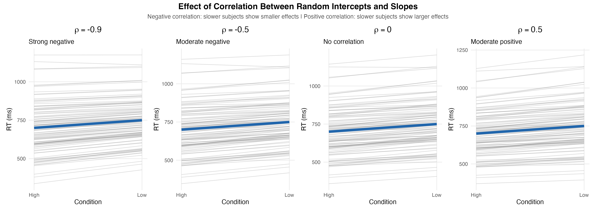
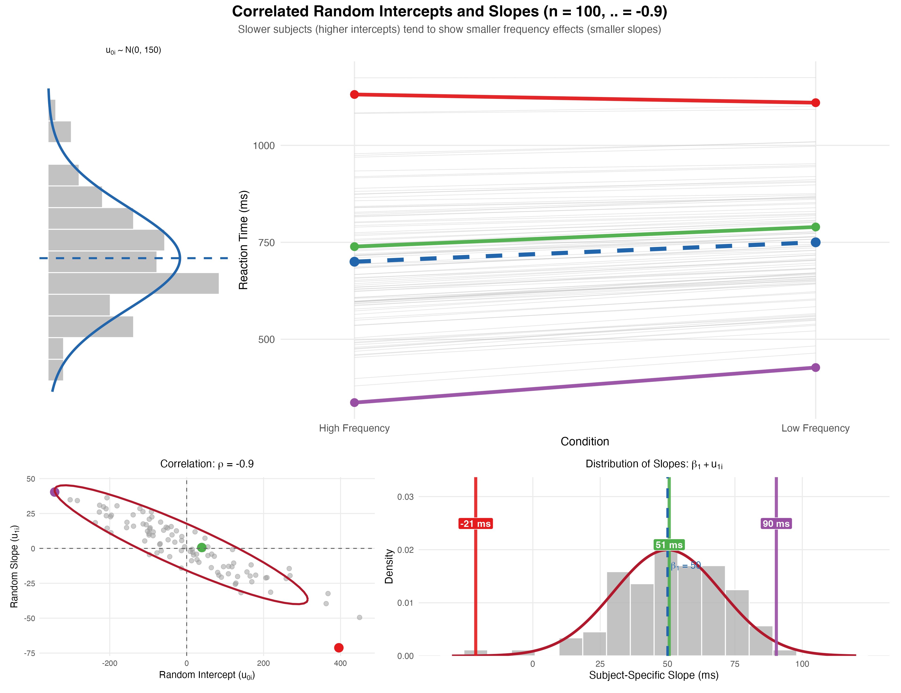

```{r}
#| label: setup
#| echo: false
#| eval: true

# load packages (suppress startup messages from lme4, lmerTest, etc.)
suppressPackageStartupMessages({
  library(tictoc)
  library(MASS)
  library(lme4)
  library(lmerTest)
  library(ggplot2)
})

options(scipen = 999) # prevents scientific notation
options(width = 120)  # wider console output for HTML rendering
set.seed(42)          # set seed for reproducibility
```

# Why correlated random effects?

In Part 4 we drew each subject's intercept and slope from **two independent**
normal distributions. That implicitly assumed that a subject's overall reading
speed is unrelated to the size of their lexical-frequency effect.

That assumption is often wrong. A common pattern in cognitive experiments:

- Generally slower participants also show **smaller** effects for the
  experimental manipulation — they may be too slow to be affected much.
- Generally faster participants show **larger** effects — they have more dynamic
  range to express the manipulation.

This pattern would create a **negative correlation** between the random
intercepts and the random slopes. In this part we extend the data-generating
process to produce that correlation.

```{r}
#| label: fig-correlation-comparison
#| echo: false
#| fig-cap: "What different values of the correlation ρ between random intercepts and slopes look like. Strong negative (ρ = -0.9): slower subjects show clearly smaller effects (lines converge). Moderate negative (ρ = -0.5): same pattern but weaker. Zero (ρ = 0): no relationship, what we had in Part 4. Positive (ρ = +0.5): slower subjects show larger effects (lines diverge)."
#| fig-align: center
#| out-width: "100%"


```

The four panels above show how subject-level data look at different values of
$\rho$. The leftmost panel ($\rho = -0.9$) is the strongest version of the
"slower-people-show-smaller-effects" pattern; the rightmost is the opposite. The
ρ = 0 panel reproduces the Part 4 model.

# Bivariate distributions and the variance-covariance matrix

To generate correlated random effects we draw the per-subject pair
$(u_{0i}, u_{1i})$ from a **bivariate normal distribution**, specified by a
variance-covariance matrix:

```{r}
#| label: fig-bivariate-normal
#| echo: false
#| fig-cap: "Bivariate normal distribution with positive correlation."
#| fig-align: center
#| out-width: "70%"

knitr::include_graphics("../img/bivariate_normal.jpg")
```

The variance-covariance matrix has the structure:

$$
\Sigma_u = \begin{pmatrix}
\sigma_{u0}^2 & \rho \, \sigma_{u0} \, \sigma_{u1} \\
\rho \, \sigma_{u0} \, \sigma_{u1} & \sigma_{u1}^2
\end{pmatrix}
$$

The diagonal entries are the variances ($\text{SD}^2$). The off-diagonal entries
are the covariances, computed as the product of the two SDs times the
correlation $\rho$.

In code:

```{r}
#| label: build-sigma-matrix
#| echo: true
#| eval: true

Sigma <- matrix(c(150^2,            150 * 20 * -0.5,
                  150 * 20 * -0.5,  20^2),
                ncol = 2)
Sigma
```

The matrix above encodes $\sigma_{u0} = 150$, $\sigma_{u1} = 20$, and
$\rho = -0.5$.

# Drawing correlated random effects

`MASS::mvrnorm()` draws samples from a multivariate normal distribution. We give
it the variance-covariance matrix and the desired mean vector (`c(0, 0)` because
random effects are centred on zero):

```{r}
#| label: fig-mvrnorm-rho-neg05
#| echo: true
#| eval: true
#| fig-cap: "Bivariate normal sample with rho = -0.5. 100 subjects."

Sigma <- matrix(c(150^2,            150 * 20 * -0.5,
                  150 * 20 * -0.5,  20^2),
                ncol = 2)

u <- MASS::mvrnorm(n = 100, mu = c(0, 0), Sigma = Sigma)

plot(u[, 1], u[, 2],
     xlab = "random intercepts",
     ylab = "random slopes")
```

The scatter plot shows a negative trend: subjects with positive intercepts
(slower overall) tend to have negative slopes (smaller effects), and vice versa.

## Other correlations for comparison

A stronger negative correlation ($\rho = -0.9$) tightens the cloud into a near-
line:

```{r}
#| label: fig-mvrnorm-rho-neg09
#| echo: true
#| eval: true
#| fig-cap: "Bivariate normal sample with rho = -0.9."

Sigma <- matrix(c(150^2,            150 * 20 * -0.9,
                  150 * 20 * -0.9,  20^2),
                ncol = 2)
u <- mvrnorm(n = 100, mu = c(0, 0), Sigma = Sigma)
plot(u[, 1], u[, 2], xlab = "random intercepts", ylab = "random slopes")
```

Zero correlation gives an isotropic cloud — equivalent to two independent
`rnorm()` calls (this is what we had in Part 4):

```{r}
#| label: fig-mvrnorm-rho-zero
#| echo: true
#| eval: true
#| fig-cap: "Bivariate normal sample with rho = 0 (independent intercepts and slopes)."

Sigma <- matrix(c(150^2, 0,
                  0,     20^2),
                ncol = 2)
u <- mvrnorm(n = 100, mu = c(0, 0), Sigma = Sigma)
plot(u[, 1], u[, 2], xlab = "random intercepts", ylab = "random slopes")
```

Positive correlation tilts the cloud the other way:

```{r}
#| label: fig-mvrnorm-rho-pos05
#| echo: true
#| eval: true
#| fig-cap: "Bivariate normal sample with rho = +0.5."

Sigma <- matrix(c(150^2,           150 * 20 * 0.5,
                  150 * 20 * 0.5,  20^2),
                ncol = 2)
u <- mvrnorm(n = 100, mu = c(0, 0), Sigma = Sigma)
plot(u[, 1], u[, 2], xlab = "random intercepts", ylab = "random slopes")
```

# Extending `gendat_ldt()` to correlated random effects

We replace the two independent `rnorm()` calls in the Part 4 generator with one
`mvrnorm()` call. The function now takes an extra argument `rho`:

```{r}
#| label: define-gendat-ldt-corr
#| echo: true
#| eval: true

gendat_ldt_corr <- function(n        = 20,
                            k        = 20,
                            b0       = 725,
                            b1       = 50,
                            sigma_u0 = 150,
                            sigma_u1 = 20,
                            rho      = -0.5, # slower subjects show smaller effects
                            sigma    = 200) {

  # variance-covariance matrix
  Sigma <- matrix(c(sigma_u0^2,                  sigma_u0 * sigma_u1 * rho,
                    sigma_u0 * sigma_u1 * rho,   sigma_u1^2),
                  ncol = 2)

  # draw correlated random effects in one call
  u           <- as.data.frame(mvrnorm(n = n, mu = c(0, 0), Sigma = Sigma))
  colnames(u) <- c("u0", "u1")
  u$subject   <- 1:n

  # build the design matrix
  cond.cod <- rep(c(-0.5, 0.5), each = n * k)
  subj     <- rep(rep(1:n, each = k), times = 2)
  sim_dat  <- data.frame(subj = subj, cond.cod = cond.cod)

  # generate RTs row by row
  nrows <- dim(sim_dat)[1]
  rt    <- rep(NA, nrows)
  for (i in 1:nrows) {
    rt[i] <- b0 +
             u[sim_dat[i, ]$subj, ]$u0 +
             (b1 + u[sim_dat[i, ]$subj, ]$u1) * sim_dat[i, ]$cond.cod +
             rnorm(1, 0, sigma)
  }

  sim_dat$rt <- rt
  sim_dat
}
```

# Fitting the correlated-random-effects model

For the LMM we switch from the **uncorrelated** `||` syntax in Part 4 to the
**correlated** `|` syntax. The model will now estimate the correlation between
the random intercepts and slopes:

```{r}
#| label: test-gendat-ldt-corr
#| echo: true
#| eval: true

sim_dat <- gendat_ldt_corr(n = 20, k = 20, rho = -0.5)

m <- lmer(rt ~ cond.cod + (1 + cond.cod | subj), sim_dat,
          control = lmerControl(calc.derivs = FALSE))
summary(m)
```

Look at the `Random effects` section of the output. The `Corr` column for the
`(Intercept), cond.cod` row should be close to the true value of $-0.5$.

::: callout-note
Unlike in Part 3, the model is no longer trying to estimate a phantom
correlation — the generative process now actually contains a real one. The
estimate should be sensible (not pinned to $\pm 1$).
:::

## Putting it all together visually

The plot below combines four views of the same dataset (n = 100 subjects,
ρ = -0.9) into one panel:

```{r}
#| label: fig-correlated-slopes-highlighted
#| echo: false
#| fig-cap: "Anatomy of correlated random intercepts and slopes (n = 100, ρ = -0.9). **Top-left:** distribution of subject random intercepts (u₀ ~ N(0, 150)). **Top-right:** each subject's RT line across the two conditions. The three highlighted subjects (red, green, purple) span the intercept distribution and show progressively different slopes. **Bottom-left:** the scatter of (u₀, u₁) pairs — the negative correlation appears as the diagonal cloud. **Bottom-right:** distribution of subject-specific slopes (β₁ + u₁). The three highlighted subjects sit at very different slopes despite belonging to the same population."
#| fig-align: center
#| out-width: "95%"


```

The bottom-left scatter is the key panel — it shows the bivariate distribution
of $(u_{0i}, u_{1i})$ we drew from `mvrnorm()`. The three coloured subjects
illustrate the mechanism: a high-intercept subject (red) sits in the
top-left of the scatter (low slope), and a low-intercept subject (purple)
sits in the bottom-right (high slope). The result is the diverging RT lines
in the top-right panel.

# Power estimation

The simulation loop is identical to Part 4 except for the model formula
(`(1 + cond.cod | subj)` instead of `(1 + cond.cod || subj)`) and the data
generator:

```{r}
#| label: power-simulation-corr
#| echo: true
#| eval: true

nsim       <- 1000
tvals_corr <- rep(NA, nsim)

for (i in 1:nsim) {
  sim_dat <- gendat_ldt_corr(n = 20, k = 20, b0 = 725, b1 = 50,
                             sigma_u0 = 150, sigma_u1 = 20,
                             rho = -0.5, sigma = 200)
  m <- lmer(rt ~ cond.cod + (1 + cond.cod | subj), sim_dat,
            control = lmerControl(calc.derivs = FALSE))
  tvals_corr[i] <- summary(m)$coefficients[2, 4]
}

power_estimate_corr <- mean(abs(tvals_corr) > 2)
round(power_estimate_corr, 3)
```

# Parameter recovery (now with six parameters)

We have one more parameter to recover compared to Part 4 — the correlation $\rho$:

```{r}
#| label: parameter-recovery-corr
#| echo: true
#| eval: true

nsim   <- 1000
params <- matrix(rep(NA, nsim * 6), ncol = 6) # now we also save the correlation

for (i in 1:nsim) {
  sim_dat <- gendat_ldt_corr(n = 20, k = 20, b0 = 725, b1 = 50,
                             sigma_u0 = 150, sigma_u1 = 20,
                             rho = -0.5, sigma = 200)
  m <- lmer(rt ~ cond.cod + (1 + cond.cod | subj), sim_dat,
            control = lmerControl(calc.derivs = FALSE))

  params[i, 1] <- summary(m)$coefficients[1, 1]  # intercept
  params[i, 2] <- summary(m)$coefficients[2, 1]  # slope
  params[i, 3] <- attr(VarCorr(m), "sc")         # SD residuals
  vc           <- as.data.frame(VarCorr(m))
  params[i, 4] <- vc$sdcor[1]                    # SD random intercepts
  params[i, 5] <- vc$sdcor[2]                    # SD random slopes
  params[i, 6] <- vc$sdcor[3]                    # correlation rho
}
```

```{r}
#| label: fig-parameter-recovery-corr
#| echo: false
#| eval: true
#| fig-cap: "Parameter recovery for the correlated random-effects model. Red lines mark the true generating values, including rho = -0.5 in the bottom-right panel."

op <- par(mfrow = c(2, 3), pty = "s")
hist(params[, 1], main = "b0 (Intercept)",        col = "lightblue"); abline(v = 725,  col = "red", lwd = 2)
hist(params[, 2], main = "b1 (Frequency Effect)", col = "lightblue"); abline(v = 50,   col = "red", lwd = 2)
hist(params[, 3], main = "SD Residuals",          col = "lightblue"); abline(v = 200,  col = "red", lwd = 2)
hist(params[, 4], main = "SD Random Intercepts",  col = "lightblue"); abline(v = 150,  col = "red", lwd = 2)
hist(params[, 5], main = "SD Random Slopes",      col = "lightblue"); abline(v = 20,   col = "red", lwd = 2)
hist(params[, 6], main = "Correlation (rho)",     col = "lightblue"); abline(v = -0.5, col = "red", lwd = 2)
par(op)
```

The correlation panel (bottom-right) is the most informative one. With n = 20
subjects, the estimate of $\rho$ is noisy and often pinned to $-1$ or $+1$ —
the same overparameterisation diagnostic we saw in Part 3, except now it
indicates that the data are not informative enough about $\rho$ rather than that
the generative process is wrong.

The takeaway: **estimating a random-effects correlation requires either many
subjects or strong correlation signal in the data**.

# Summary and next step

In this part we:

- Recognised that random intercepts and slopes are often **correlated** in real
  data.
- Replaced two independent `rnorm()` calls with one `mvrnorm()` call, controlled
  by a variance-covariance matrix.
- Wrapped the new generator in `gendat_ldt_corr()` with `rho` as an extra
  argument.
- Fit the correlated model using the `|` syntax in `lmer()`.
- Saw that the correlation parameter is the hardest to recover and often hits
  $\pm 1$ with small n.

The mathematical form of the data-generating process is now:

$$
rt_{ij} = \beta_0 + u_{0i} + (\beta_1 + u_{1i}) \times \text{cond.cod}_{ij} + \varepsilon_{ij}
$$

with $\varepsilon_{ij} \sim \text{Normal}(0, \sigma)$ and

$$
\begin{pmatrix} u_0 \\ u_1 \end{pmatrix} \sim \text{MVN} \left(
\begin{pmatrix} 0 \\ 0 \end{pmatrix}, \, \Sigma_u \right), \quad
\Sigma_u = \begin{pmatrix}
\sigma_{u0}^2 & \rho \, \sigma_{u0} \sigma_{u1} \\
\rho \, \sigma_{u0} \sigma_{u1} & \sigma_{u1}^2
\end{pmatrix}
$$

The next part of the course adds **by-item adjustments to the intercept**.
Items (words in our LDT example) come from a pool with their own variability:
some words are responded to faster than others, independent of which subject is
reading them.

# Session information

```{r}
#| label: session-info
#| echo: false
#| eval: true
#| code-fold: true

sessionInfo()
```
