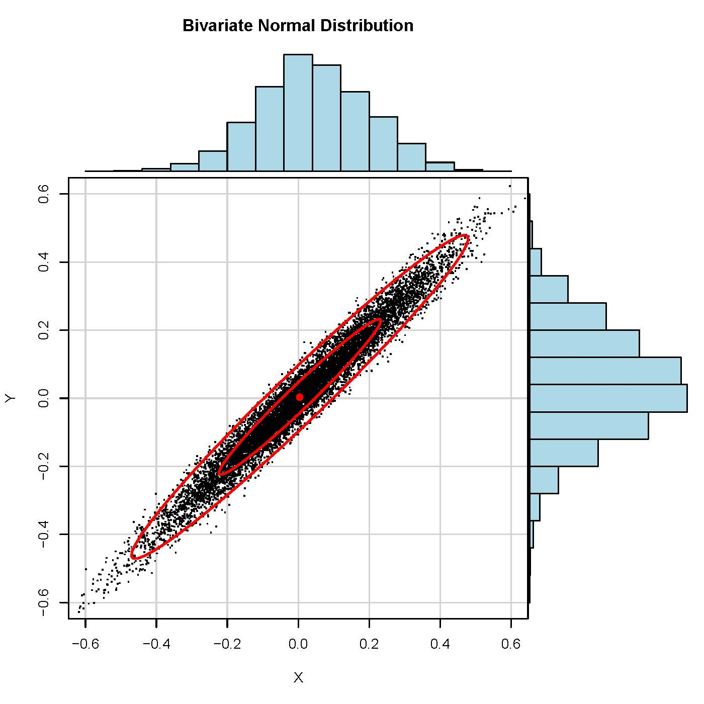

## Part 5: Generating data with correlated random intercepts and slopes

```{r}
#| label: setup
#| echo: false
#| eval: true

# load packages (suppress startup messages from lme4, lmerTest, etc.)
suppressPackageStartupMessages({
  library(tictoc)
  library(MASS)
  library(lme4)
  library(lmerTest)
  library(ggplot2)
})

options(scipen = 999) # prevents scientific notation
options(width = 120)  # wider console output for HTML rendering
set.seed(42)          # set seed for reproducibility
```

Now we want to generate data with correlated random intercepts and slopes.
Why would we want to do that?

::: incremental
- Perhaps, those participants that are generally slower also show smaller effects for the experimental manipulation. They can be too slow to be affected by the manipulation.
- This would create a negative correlation between random intercepts and slopes.
- So far, random intercepts and slopes came from two independent normal distributions.
- How do we generate correlations between them?
:::

## Part 5: Generating data with correlated random intercepts and slopes

**Question: How do we generate correlated intercepts and slopes?**

::: incremental
-   Answer: By using a bivariate distribution, specifying the variances of the two variables and their covariance in a variance-covariance matrix.
-   What does a bivariate normal distribution look like?
:::

## Part 5: Generating data with correlated random intercepts and slopes

**What does a bivariate normal distribution look like?**

```{r}
#| label: fig-bivariate-normal
#| echo: false
#| caption: "Bivariate normal distribution with positive correlation."
#| fig-align: center
#| out-width: "70%"


```

## Part 5: Generating data with correlated random intercepts and slopes

First, create the variance-covariance matrix:

```{r}
#| label: build-sigma-matrix
#| echo: true
#| eval: true
#| output-location: fragment

# variance-covariance matrix:
Sigma <- matrix(c(150^2, 150*20*-0.5,
                  150*20*-0.5, 20^2), ncol = 2)
Sigma
```

::: incremental
-   on the diagonals are the variances (SD^2)
-   on the off-diagonals are the covariances: the two standard deviations multiplied by the correlation
:::

## Part 5: Generating data with correlated random intercepts and slopes

Now we will use the variance-covariance matrix and plug it into the mvrnorm() function to generate a multivariate distribution with correlated random intercepts and slopes.

```{r}
#| label: fig-mvrnorm-rho-neg05
#| echo: true
#| eval: true

# variance-covariance matrix:
Sigma <- matrix(c(150^2, 150*20*-0.5,
                  150*20*-0.5, 20^2), ncol = 2)

u <- MASS::mvrnorm(n = 100, mu = c(0,0), Sigma = Sigma) # generate data from 100 subjects

plot(u[,1], u[,2], xlab = "random intercepts", ylab = "random slopes")
```

## Part 5: Generating data with correlated random intercepts and slopes

**If the correlation was even more negative (-.9):**

```{r}
#| label: fig-mvrnorm-rho-neg09
#| echo: true
#| eval: true

Sigma <- matrix(c(150^2, 150*20*-0.9,
                  150*20*-0.9, 20^2), ncol = 2)

u <- mvrnorm(n = 100, mu = c(0,0), Sigma = Sigma)

plot(u[,1], u[,2], xlab = "random intercepts", ylab = "random slopes")
```

## Part 5: Generating data with correlated random intercepts and slopes

**If the correlation was 0 (this would correspond to two independent rnorm() functions):**

```{r}
#| label: fig-mvrnorm-rho-zero
#| echo: true
#| eval: true

Sigma <- matrix(c(150^2, 150*20*0,
                  150*20*0, 20^2), ncol = 2)

u <- mvrnorm(n = 100, mu = c(0,0), Sigma = Sigma)

plot(u[,1], u[,2], xlab = "random intercepts", ylab = "random slopes")
```

## Part 5: Generating data with correlated random intercepts and slopes

**...or positive correlation:**

```{r}
#| label: fig-mvrnorm-rho-pos05
#| echo: true
#| eval: true

Sigma <- matrix(c(150^2, 150*20*0.5,
                  150*20*0.5, 20^2), ncol = 2)

u <- mvrnorm(n = 100, mu = c(0,0), Sigma = Sigma)

plot(u[,1], u[,2], xlab = "random intercepts", ylab = "random slopes")
```

## Part 5: Generating data with correlated random intercepts and slopes

**Let's extend the gendat_ldt() function to generate correlated intercepts and slopes:**

## Part 5: Generating data with correlated random intercepts and slopes

**Let's extend the gendat_ldt() function to generate correlated intercepts and slopes:**

```{r}
#| label: define-gendat-ldt-corr
#| echo: true
#| eval: true
#| code-line-numbers: "|7|10-11|13-15"

gendat_ldt_corr <- function(n = 20,
                            k = 20,
                            b0 = 725, 
                            b1 = 50,
                            sigma_u0 = 150, 
                            sigma_u1 = 20,
                            rho = -0.5, # slower subjects show smaller frequency effect
                            sigma = 200){

  Sigma <- matrix(c(sigma_u0^2, sigma_u0*sigma_u1*rho,
                    sigma_u0*sigma_u1*rho, sigma_u1^2), ncol = 2)

  u <- as.data.frame(mvrnorm(n = n, mu = c(0,0), Sigma = Sigma))
  colnames(u) <- c("u0", "u1")
  u$subject <- 1:n

  cond.cod <- rep(c(-0.5, 0.5), each = n * k)
  subj <- rep(rep(1:n, each = k), times = 2)
  sim_dat <- data.frame(subj = subj, 
                        cond.cod = cond.cod)

  nrows <- dim(sim_dat)[1]
  rt <- rep(NA, nrows)

  for(i in 1:nrows) {
    rt[i] <- b0 +
      u[sim_dat[i,]$subj,]$u0 +
      (b1 + u[sim_dat[i,]$subj,]$u1) * sim_dat[i,]$cond.cod +
      rnorm(1, 0, sigma)
  }

  sim_dat$rt <- rt
  sim_dat
}
```

## Part 5: Generating data with correlated random intercepts and slopes

**Test the correlated random effects:**

```{r}
#| label: test-gendat-ldt-corr
#| echo: true
#| eval: true
#| output-location: fragment

sim_dat <- gendat_ldt_corr(n = 20, k = 20, rho = -0.5)

m <- lmer(rt ~ cond.cod + (1 + cond.cod|subj), sim_dat,
          control = lmerControl(calc.derivs = FALSE))
summary(m)
```

## Part 5: Generating data with correlated random intercepts and slopes

**Calculate the power for a model with correlated random effects:**

```{r}
#| label: power-simulation-corr
#| echo: true
#| eval: true
#| output-location: fragment

nsim <- 1000
tvals_corr <- rep(NA, nsim)

for(i in 1:nsim){
  sim_dat <- gendat_ldt_corr(n = 20,
                             k = 20,
                             b0 = 725, 
                             b1 = 50,
                             sigma_u0 = 150, 
                             sigma_u1 = 20,
                             rho = -0.5,
                             sigma = 200)
  m <- lmer(rt ~ cond.cod + (1 + cond.cod|subj), sim_dat,
            control = lmerControl(calc.derivs = FALSE))
  tvals_corr[i] <- summary(m)$coefficients[2,4]
}

power_estimate_corr <- mean(abs(tvals_corr) > 2)
round(power_estimate_corr, 3)
```

## Part 5: Generating data with correlated random intercepts and slopes

**Check the parameter recovery:**

```{r}
#| label: parameter-recovery-corr
#| echo: true
#| eval: true
#| code-line-numbers: "|2|21"

nsim <- 1000
params <- matrix(rep(NA, nsim*6), ncol = 6) # Now we also save correlations

for(i in 1:nsim){
  sim_dat <- gendat_ldt_corr(n = 20, 
                             k = 20,
                             b0 = 725, 
                             b1 = 50,
                             sigma_u0 = 150, 
                             sigma_u1 = 20,
                             rho = -0.5,
                             sigma = 200)
  m <- lmer(rt ~ cond.cod + (1 + cond.cod|subj), sim_dat,
            control = lmerControl(calc.derivs = FALSE))
  params[i, 1] <- summary(m)$coefficients[1,1] # intercept
  params[i, 2] <- summary(m)$coefficients[2,1] # slope
  params[i, 3] <- attr(VarCorr(m), "sc")       # sd of residuals
  vc <- as.data.frame(VarCorr(m))
  params[i, 4] <- vc$sdcor[1]                  # sd random intercepts
  params[i, 5] <- vc$sdcor[2]                  # sd random slopes
  params[i, 6] <- vc$sdcor[3]                  # correlation rho
}
```

## Part 5: Generating data with correlated random intercepts and slopes

**Visualize parameter recovery:**

```{r}
#| label: fig-parameter-recovery-corr
#| echo: false
#| eval: true

op <- par(mfrow = c(2,3), pty = "s")
hist(params[,1], main = "b0 (Intercept)", col = "lightblue")
abline(v=725, col = "red", lwd = 2)
hist(params[,2], main = "b1 (Frequency Effect)", col = "lightblue")
abline(v=50, col = "red", lwd = 2)
hist(params[,3], main = "SD Residuals", col = "lightblue")
abline(v=200, col = "red", lwd = 2)
hist(params[,4], main = "SD Random Intercepts", col = "lightblue")
abline(v=150, col = "red", lwd = 2)
hist(params[,5], main = "SD Random Slopes", col = "lightblue")
abline(v=20, col = "red", lwd = 2)
hist(params[,6], main = "Correlation (rho)", col = "lightblue")
abline(v=-0.5, col = "red", lwd = 2)
par(op)
```

## So far we have:

...generated data with correlated by-subject adjustments to intercepts and slopes:

$$
rt_{ij} = \beta_0 + u_{0i} + (\beta_1 + u_{1i}) \times cond.cod_{ij} + \varepsilon_{ij}
$$ where $\varepsilon_{ij} \sim Normal(0, \sigma)$ and

$$
\begin{pmatrix} u_0 \\ u_1 \end{pmatrix} \sim MVN \left( \begin{pmatrix} 0 \\ 0 \end{pmatrix}, \Sigma_u \right), \quad
$$

$$
\Sigma_u = \begin{pmatrix}
\sigma_{u0}^2 & \rho_u \sigma_{u0} \sigma_{u1} \\
\rho_u \sigma_{u0} \sigma_{u1} & \sigma_{u1}^2
\end{pmatrix} \quad
$$

## Next step:

-   We will now continue generating data with by-item adjustments to intercepts (because words, as subjects, come with their own variability).

##  Preguntas? {background-color="#43464B"}

## Session information {.smaller}

```{r}
#| label: session-info
#| echo: false
#| eval: true

sessionInfo()
```
